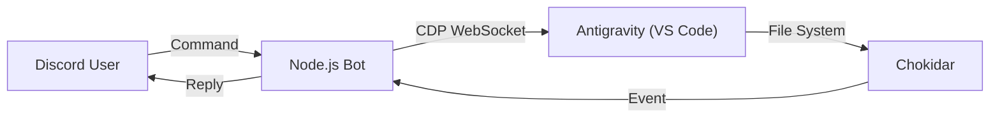

# Antigravity Discord Bot 仕様書

## 1. 概要
このBotは、Chrome DevTools Protocol (CDP) を利用して、ローカルで動作するAntigravity (VS Code Fork) をDiscordから遠隔操作するためのツールです。
Antigravity自体にはAPIがないため、CDPを通じてDOM操作やJavaScript実行を行うことで機能を実現しています。

## 2. システム構成

### アーキテクチャ図


### 主要コンポーネント
- **CDP (Chrome DevTools Protocol)**: AntigravityのメインドキュメントのDOMにアクセスし、ボタンクリックやテキスト取得を行います。
- **Chokidar**: ファイルシステムの変更を監視し、Antigravityが生成したファイルや変更を検知してDiscordに通知します。
- **Discord.js**: Discord APIとの通信を行います。

## 3. 機能詳細

### 3.1 テキスト生成
- ユーザーからのメッセージをCDP経由でAntigravityのチャット入力欄に注入します。
- 入力欄のセレクター: `textarea[class*="input"]` など
- 送信ボタンのクリックまたは `Enter` キーイベントの発火によって生成を開始します。

### 3.2 AI応答の抽出
生成完了後、`.antigravity-agent-side-panel` 内のメッセージコンテナからAIの回答テキストを抽出します。

**抽出ロジック:**
1. メッセージコンテナ（`.relative.flex.flex-col.gap-y-3.px-4`）の子ブロックを取得
2. 下から走査し、最新のユーザー送信ブロック（`undo` ボタンを持つブロック）を特定
3. ユーザーブロック以降のブロックをレスポンス対象として抽出（ユーザーが最後のブロックならそのブロック自体を含める）
4. ノイズ除去: Thought/Ran command ヘッダー、style要素、Good/Badボタン、undo要素を除去
5. **回答全文テキスト**: 下から最大4000文字
6. **返信テキスト**: 下から最大1900文字

**技術メモ:**
- CDP式は `Function.toString()` + 文字列連結方式で生成（テンプレートリテラルのエスケープ問題を回避）
- スクロール処理は廃止（表示範囲のテキストのみ取得）
- iframe走査は廃止（チャットパネルはメインdocument上に存在）

### 3.3 モデル切替 (`/model`)
- AntigravityのUI上にあるモデル選択ドロップダウンを操作します。
- **DOM操作**:
  1. `<button aria-expanded="false">` をクリックしてドロップダウンを展開。
  2. ドロップダウン内のモデル名リストを取得。
  3. 指定されたモデル名の要素をクリック。

### 3.4 モード切替 (`/mode`)
- Planning Mode / Fast Mode の切替を行います。
- **DOM操作**:
  1. モード切替トグルをクリック。
  2. ダイアログ内の "Planning" または "Fast" をクリック。

### 3.5 チャットタイトル取得 (`/title`)
- 現在のチャットセッションのタイトルを取得します。
- `p.text-ide-sidebar-title-color` クラスを持つ要素のテキストを取得します。

### 3.6 承認ボタン処理
AIエージェントが実行許可を求める承認ダイアログを検出し、Discord経由で制御します。

**承認キーワード（11種）:**
```text
Run, Accept, Accept all, Allow, Always Allow,
Keep Waiting, Continue, Allow Once, Allow This Conversation, Retry, allow access
```

**抽出・クリックロジックの強化 (v1.4.0):**
- **Shadow DOM 対応**: メインのDOMだけでなく、Shadow DOM内部の要素も再帰的に走査し、隠れた承認ボタンを検出します。
- **全ターゲット横断スキャン**: 複数のターゲット（ページやワーカー）が存在する場合でも、全ターゲットを横断してスキャンを行い、承認ボタンのあるターゲット（`targetUrl`）を特定して接続し、クリック処理を確実に行います。

**拒否キーワード:**
```
Reject, Cancel, Deny
```

**保護ロジック:**
| 保護レイヤー | 内容 |
|---|---|
| **ドロップダウン除外** | `aria-haspopup="listbox"` を持つボタンをスキップ（「Always run」の誤認防止） |
| **Safe Click** | 親コンテナ内に拒否ボタンが存在する場合のみ「本物の承認ダイアログ」と判定 |
| **キーワードマッチ** | 完全一致 + スペース区切り前方一致（例: "run" ✅, "run command" ✅, "running" ❌） |

**動的Discord ボタン:**
- Antigravity側のボタンラベルをそのままDiscordボタンに反映
- ユーザーがクリックしたDiscordボタンのラベルに対応するAntigravity側ボタンを正確にクリック

### 3.7 Smart Safety（破壊的コマンドのブロック）
自動承認モードでも以下の危険なコマンドパターンが検出された場合、自動承認をスキップしてDiscordに手動承認を要求します。

**ブロック対象パターン（11種）:**
```
rm -rf /,  rm -rf ~,  rm -rf *,  format c:,  del /f /s /q,
rmdir /s /q,  :(){:|:&};:,  dd if=,  mkfs.,  > /dev/sda,  chmod -R 777 /
```

### 3.8 ファイル監視
- プロジェクトルート以下のファイル変更を監視します（環境変数 `WATCH_DIR` で指定可能）。
- 除外ファイル: `node_modules`, `.git`, `.env`, ログファイルなど。
- 新規作成 (`add`) または変更 (`change`) があった場合、Discordに通知します。

## 4. セキュリティ

### 起動時チェック
- `DISCORD_ALLOWED_USER_ID` が未設定の場合、ボットは起動を拒否します（v1.3以降）。
- エラーメッセージにDiscord User IDの取得手順を表示します。

### アクセス制御
- すべてのコマンドは `DISCORD_ALLOWED_USER_ID` に一致するユーザーからのみ受け付けます。
- 不正なユーザーのメッセージは無視されます。

## 5. 環境設定

### 必要な環境変数 (.env)
| 変数名 | 必須 | 説明 |
|---|---|---|
| `DISCORD_BOT_TOKEN` | ✅ | Discord Botのトークン |
| `DISCORD_ALLOWED_USER_ID` | ✅ | 操作を許可するユーザーID |
| `WATCH_DIR` | ❌ | 監視対象のディレクトリパス（未指定時は対話的に設定） |
| `DISCORD_ACTIVITY_LOG` | ❌ | アクティビティログの出力先パス |
| `DISCORD_TEST_CHANNEL_ID` | ❌ | テスト用チャンネルID |

### 依存関係
- `discord.js`: ^14.x
- `chokidar`: ^3.x
- `ws`: ^8.x
- `dotenv`: ^16.x
